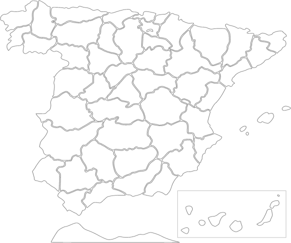

# Spain provinces Javascript Map

## ¿Qué hay?
Un mapa de las provincias Españolas en Javascript, con la ayuda de [RaphaelJS](http://raphaeljs.com/).
Como imagen base, se ha utilizado [esta](https://parall.ax/blog/view/2985/tutorial-creating-an-interactive-svg-map)

## ¿Qué puedo hacer con él?
Quería mostrar mapas con estadísticas. Como no encontraba ninguno libre que fuese sencillo
de utilizar, decidí crear este.

Puedes mostrar estadísticas (por ejemplo, resultado de elecciones), un directorio de enlaces... Lo que se te ocurra

## ¿Que debo hacer para utilizarlo?
Clona el repositorio y utiliaz los ficheros "map.js" e "index.html". Para cambiar los colores de las provincias y
demás, utiliza las variables que hay declaradas en "map.js"

## Quiero generar mi propio mapa
[Lee este tutorial](https://parall.ax/blog/view/2985/tutorial-creating-an-interactive-svg-map)

## Licencia
Es libre, utilizando GPLv3
